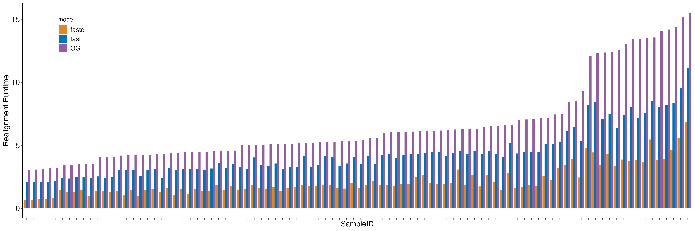

# polysolvermod benchmark

This repo hosts benchmark results of [polysolvermod](https://github.com/svm-zhang/polysolverMod) on data from 1000 genome project for both HLA Class I and II alleles.

`polysolvermod` achieves similar accuracy as the original `polysovler` program (not suprisingly as the former is a re-engineered version of the latter). At 4-digit resolution `polysolvermod` accurately typed about 94% and 95% alleles for
Asian and CEU samples, respectively. This is on par with the [benchmark study](https://www.nature.com/articles/jhg2016141) previously reported.

`polysolvermod` extends the capability of the original `polysolver` algorithm to Class II alleles. The accuracies on both Asian and CEU samples are well above 80%. And they get further boosted to 90% when controlling for number of mismatch events per alignment.

## Understand benchmark files

* Files without `eval` in the suffix are the typing results
* Files with `eval` in the suffix are the ones used for accuracy evaluation

Columns in the evaluation result files:
* p1 and p2: predicted alleles from `polysolvermod`
* e1 and e2: expected alleles from 1000 genome HLA typing result
* n_match: number of predicted alleles matching the expected ones per HLA gene

## Runtime profiling

`polysolvermod` tries to have improved runtime over the original `polysolver`. The plot below demonstrates the runtime improvement on fishing + realignment.

## Disclaimer

